# FNote

Foreign Note Card – an iOS companion app for language learners.

FNote is built for language learners who are starting to learn new languages and want to quickly write down new words or phrases they learn.

Available on [App Store](https://apps.apple.com/app/id1455029307).

## Implementations

- Written in Swift
- Main UI layouts: *Collection View* and *Collection View Compositional Layout*
- Frameworks: **SwiftUI**, **UIKit**, **Core Data**, **Combine**
- Desgin pattern: **MVVM**, **MVC**
- Implement Core Data & CloudKit auto sync
- Integrate [Down](https://github.com/iwasrobbed/Down), a public Markdown rendering library for Swift
- Support Dynamic Type which adapts to user's font-scale preference.

## Preview

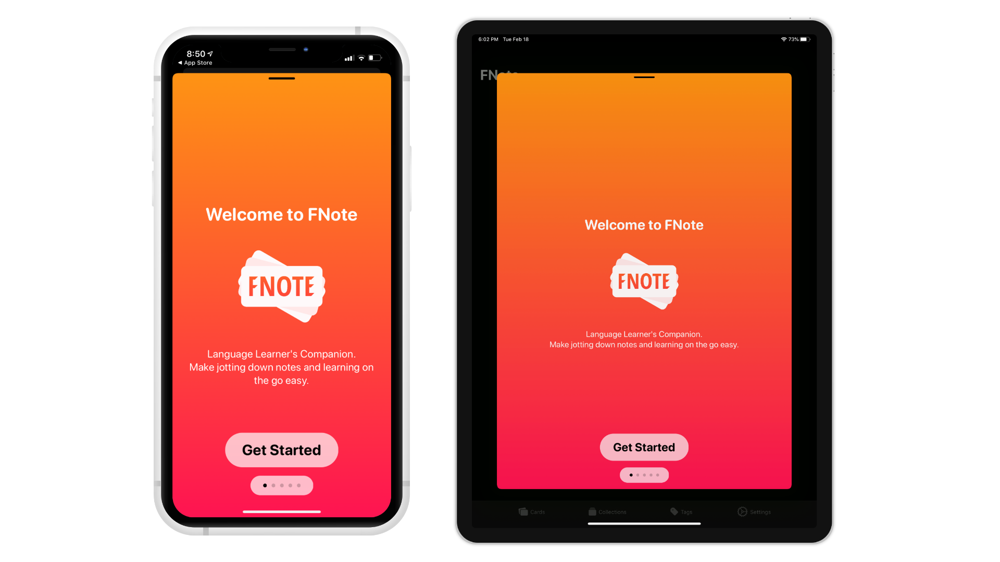

### iPhone Light Mode

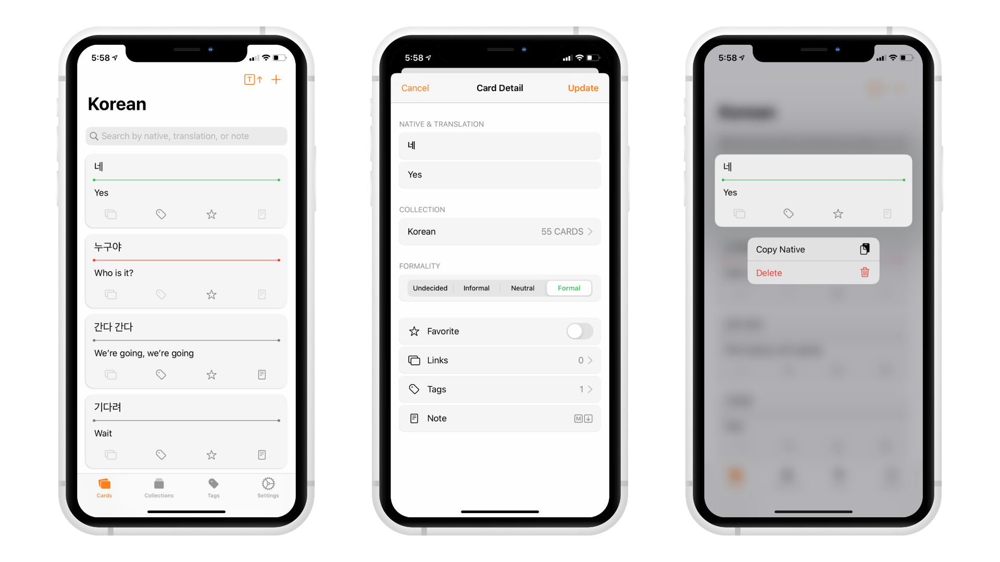
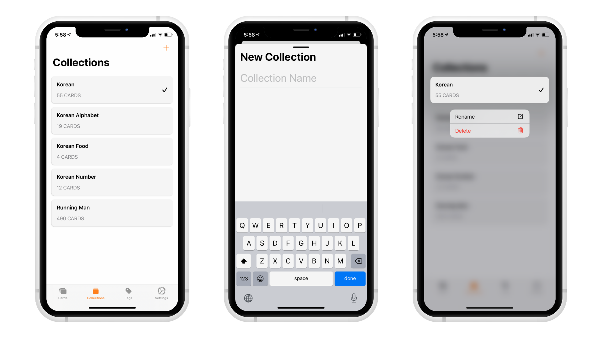
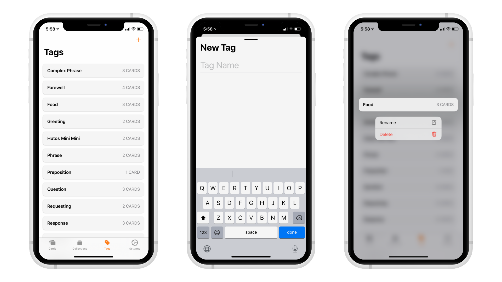
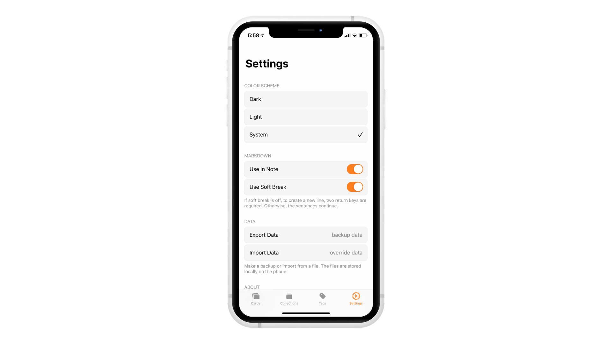

### iPhone Dark Mode

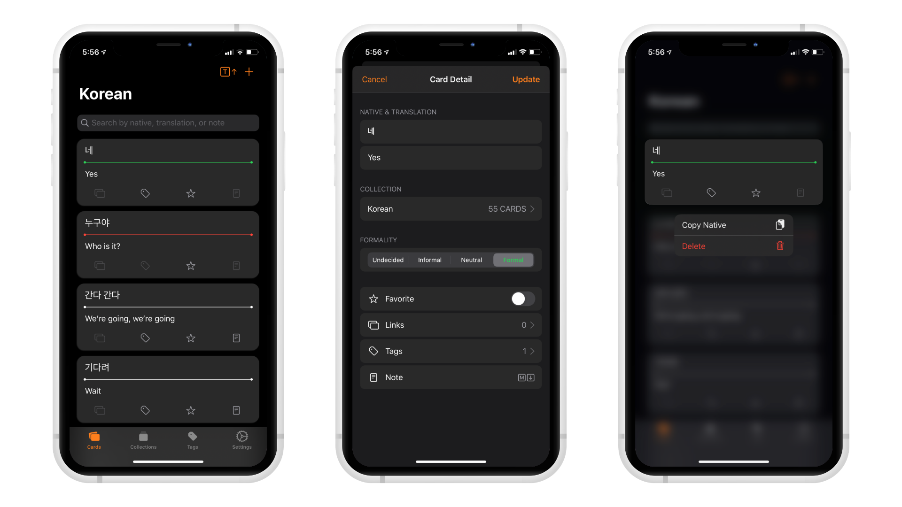
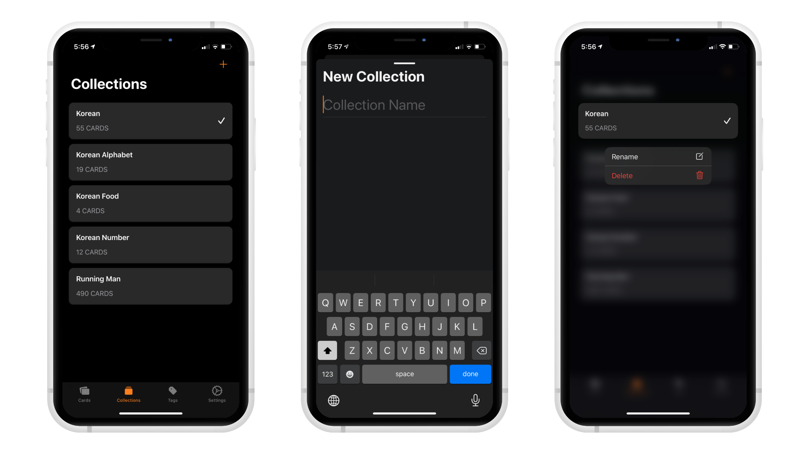
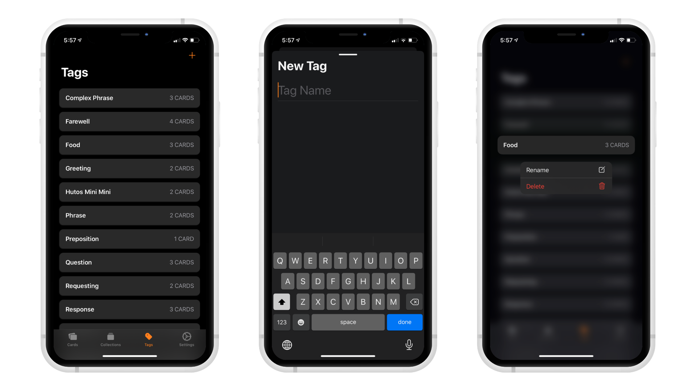
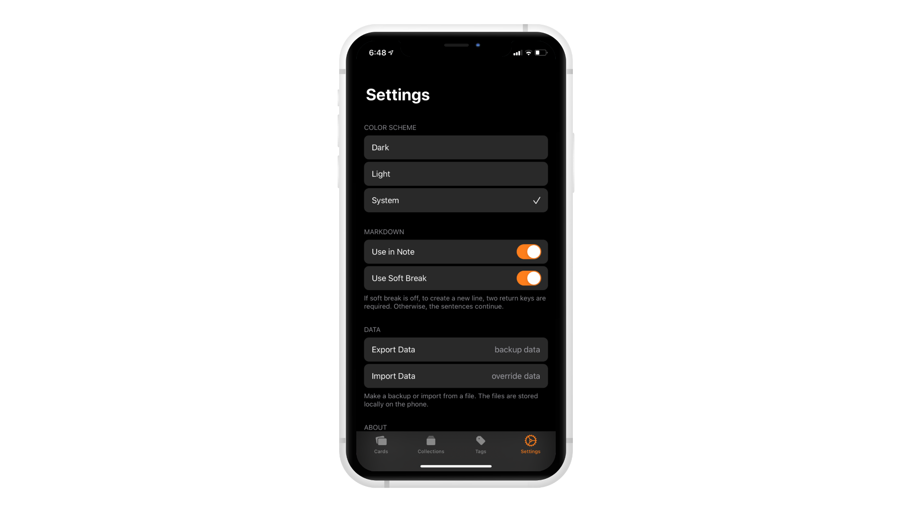

### iPad Light Mode

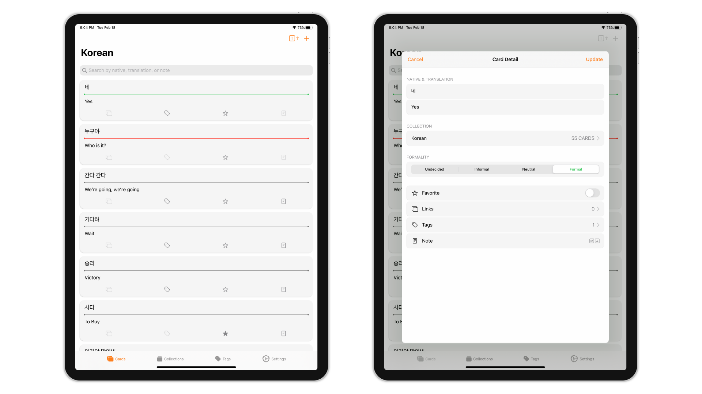
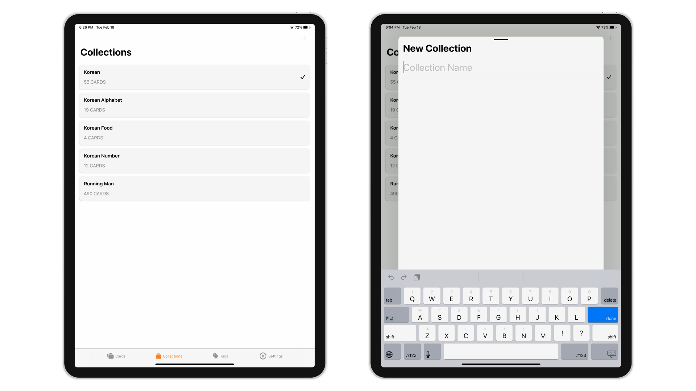
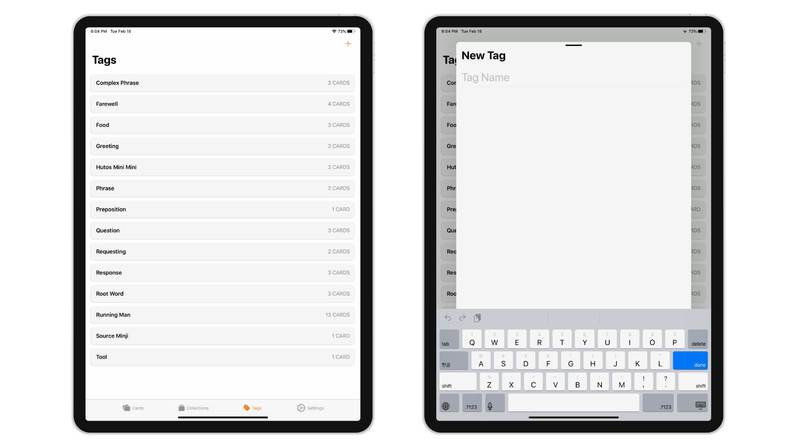
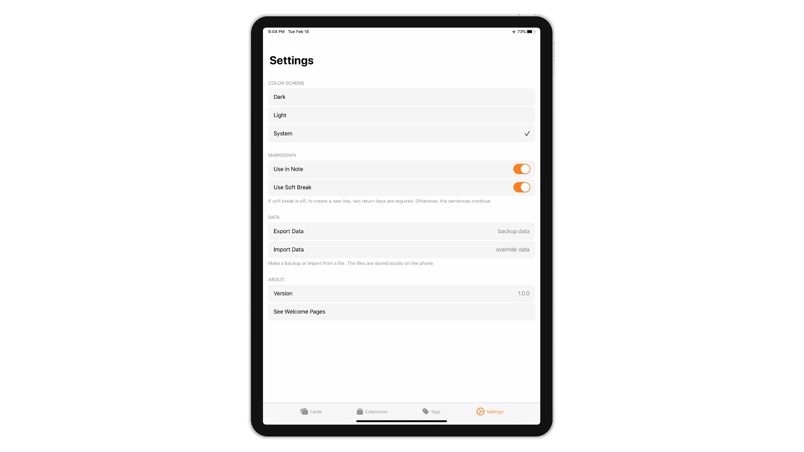

### iPad Dark Mode

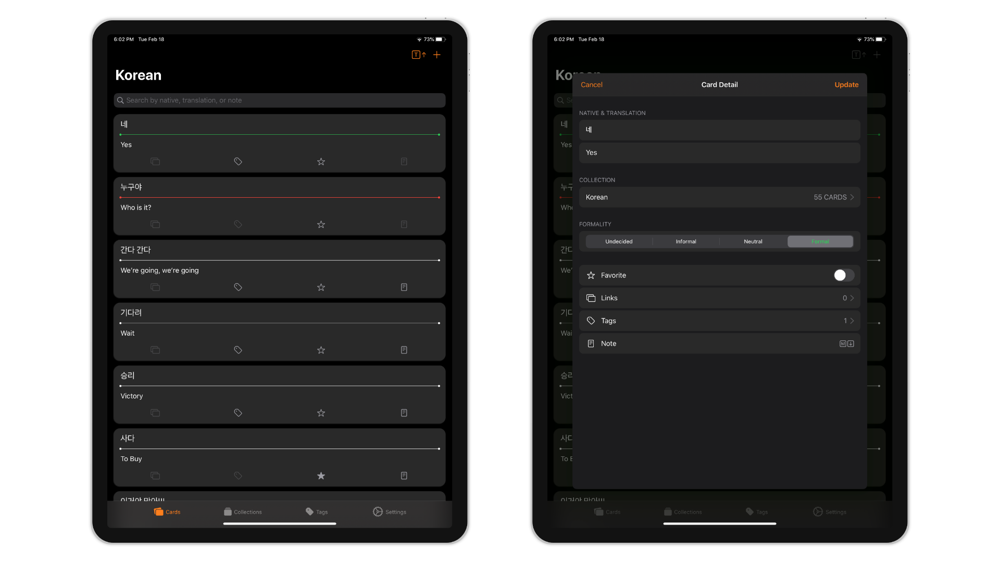
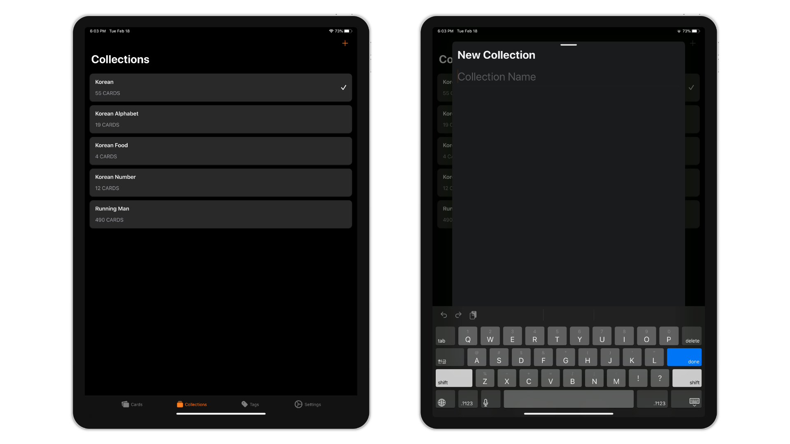
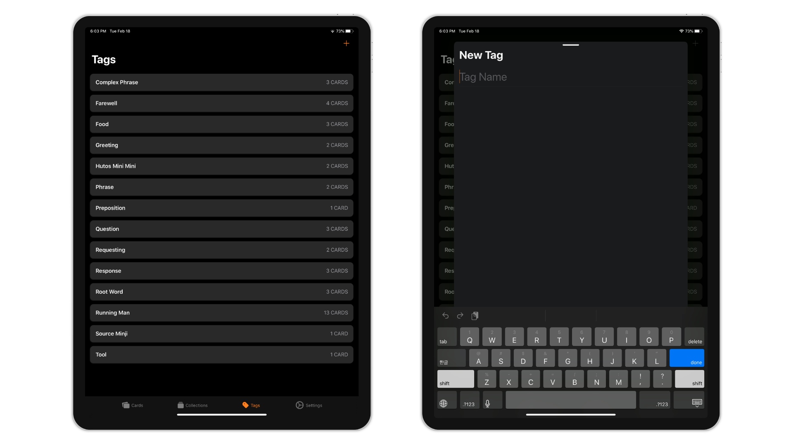
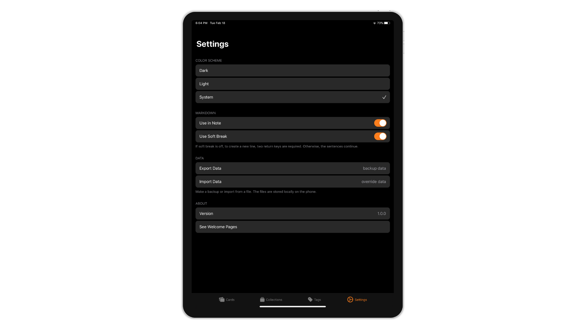
