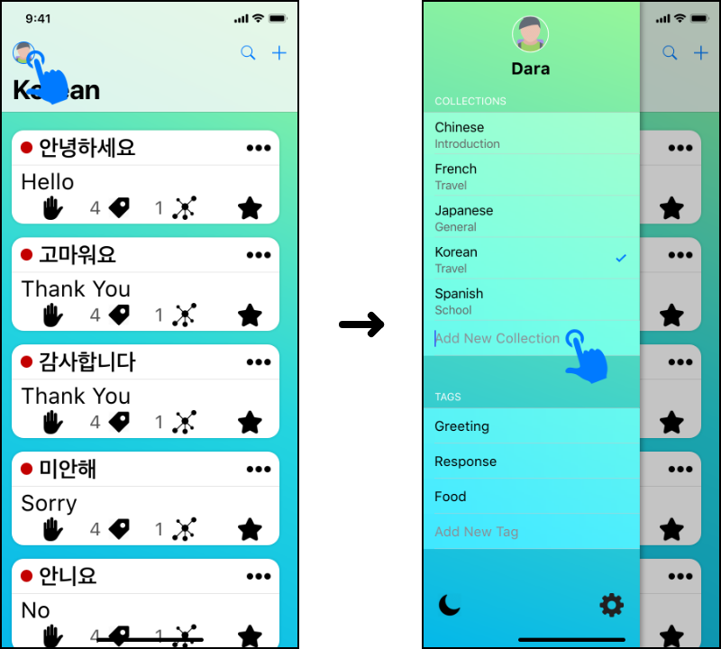
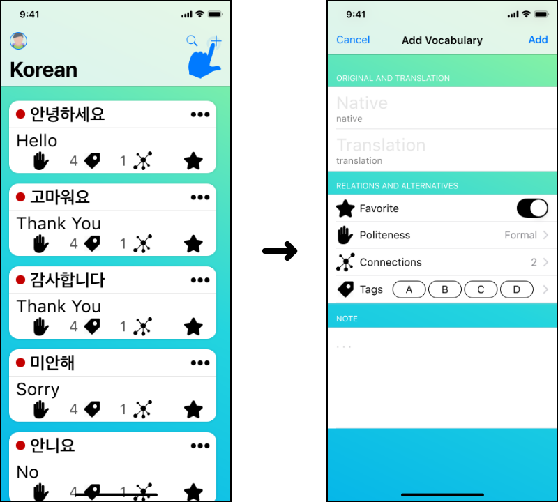
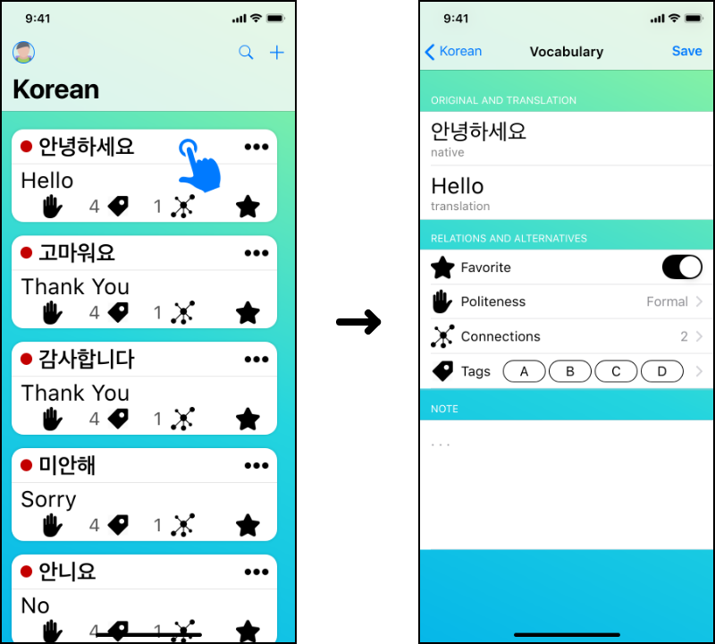
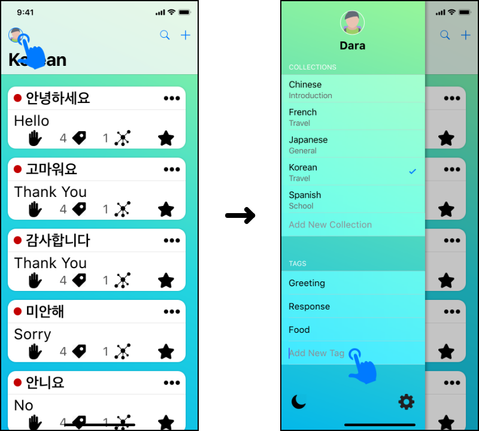
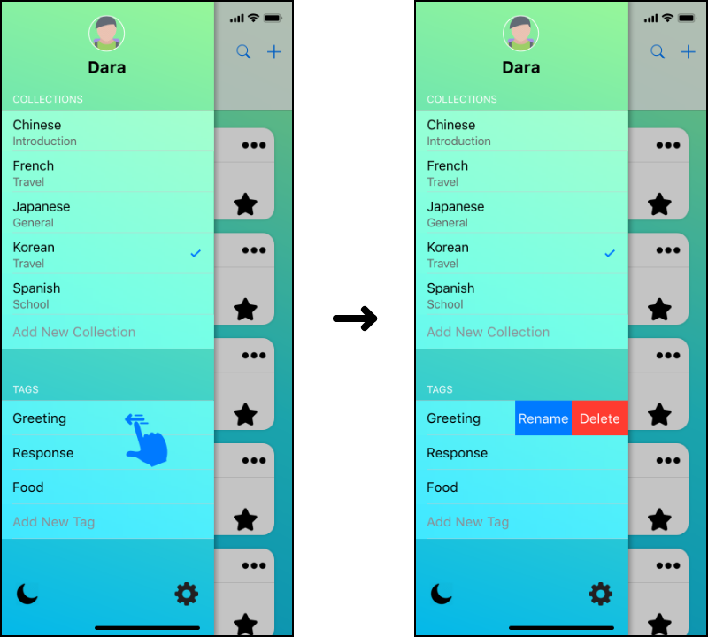
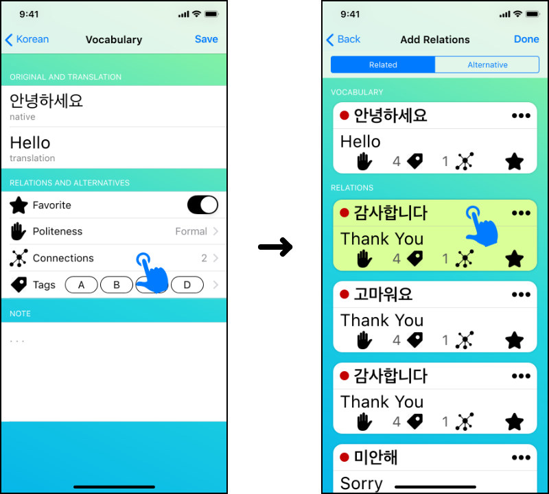

# User Manual <!-- omit in toc -->

## Contents <!-- omit in toc -->

- [Introduction](#introduction)
- [Requirements](#requirements)
- [Getting Started](#getting-started)
  - [Downloading the App](#downloading-the-app)
  - [Create Vocabulary Collection](#create-vocabulary-collection)
  - [Update Vocabulary Collection](#update-vocabulary-collection)
  - [Delete Vocabulary Collection](#delete-vocabulary-collection)
  - [Create Vocabulary](#create-vocabulary)
  - [Update Vocabulary](#update-vocabulary)
  - [Delete Vocabulary](#delete-vocabulary)
  - [Create Tag](#create-tag)
  - [Update Tag](#update-tag)
  - [Delete Tag](#delete-tag)
  - [Connect Vocabulary](#connect-vocabulary)
  - [Disconnect Vocabulary](#disconnect-vocabulary)
  - [Sync Data Across Devices](#sync-data-across-devices)
- [Support](#support)

## Introduction

Learning a new language is fun, but can also be very challenging. Usually, note-taking is involved in the process of learning new vocabulary or common phrases.

Taking notes with a notebook or on an electronic device is one of many good ways to get started. However, as the collection of vocabularies or phrases grow larger, it can be harder to try to track down which vocabularies are related to which because they are either on different pages or there is no more space to insert another definition.

Introducing **Foreign Note** (FNote), a mobile application with the ultimate goal to improve the experience of learning a new language. That is, to make note taking more convenient and easier than before. The core functionality allows users to write down phrases or words along with their corresponding definitions and save them into once place, called Collection where user can create as many as they needed. The user then can place a tag on a word or define whether a word is related to or an alternative of another word within their entire list of collections.

With FNote, users can continue adding more vocabularies to their collections, and quickly search and filter through them as they please. Therefore, users will no longer need to fumble through unorganized notes or worry about running out of paper in the middle of their note-taking process.

## Requirements

- iOS device with version 10.0 or above.
- A valid Apple ID
- Age Rating 4+

## Getting Started

### Downloading the App

1. Open App Store and search for "Foreign Note".
2. Download and install Foreign Note on the device.
3. Open Foreign Note app. It is ready to use.

### Create Vocabulary Collection

1. Navigate to user profile.
2. Under Vocabulary Collection section, tap the text field to name the collection.
3. Tap 'Done' on the keyboard.

### Update Vocabulary Collection

1. Navigate to user profile.
2. Swipe left on the desired collection to be renamed.
3. Tap the rename button.
4. Rename the collection and tap 'Done' on the keyboard.

### Delete Vocabulary Collection

1. Navigate to user profile.
2. Swipe left on the desired collection to be removed.
3. Tap the delete button.

*Note*: Deleting a collection will also delete all vocabularies inside of it.

### Create Vocabulary

1. Choose a collection.
2. Tap the '+' button.
3. Fill in required fields.
4. Tap the 'Add' button to add the vocabulary to the collection.

### Update Vocabulary

1. Choose a vocabulary to update.
2. Update the desired fields.
3. Tap the 'Save' button to save changes.

### Delete Vocabulary

1. Find a vocabulary to delete.
2. Tap the more button represented by '•••'.
3. Select 'Delete'.

### Create Tag

#### In User Profile <!-- omit in toc -->

1. Navigate to user profile.
2. Tap the text field under Tag section to name a new tag.
3. Tap 'Done' on the keyboard.

#### While Adding or View Vocabulary <!-- omit in toc -->

1. While adding or viewing vocabulary, tap the tag icon.
2. Tap the text field to name the tag.
3. Tap 'Done' on the keyboard.

### Update Tag

1. Find a tag to rename.
2. Swipe left on the tag to be renamed.
3. Tap the rename button.
4. Rename the tag and tap 'Done' on the keyboard.

### Delete Tag

1. Find a tag to delete.
2. Swipe left on the tag to be deleted.
3. Tap the delete button.

### Connect Vocabulary

1. While adding or viewing, tap the connection icon.
2. Choose a connection type.
3. Select one or more vocabularies to be connected.

*Note*: The selected vocabulary is highlighted to indicate that the vocabulary is connected.

### Disconnect Vocabulary

1. While adding or viewing, tap the connection icon.
2. Choose a connection type.
3. Select one or more vocabularies to be disconnected.

*Note*: The highlight of the selected vocabulary will be removed to indicate that the vocabulary is disconnected.

### Sync Data Across Devices

Foreign Note app syncs data across all user's devices that logged into the same Apple ID.

## Support

For more information or helps, visit our [homepage][homepage].

<!-- Link -->
[homepage]: https://idara09.github.io/FNote

<!-- Asset -->